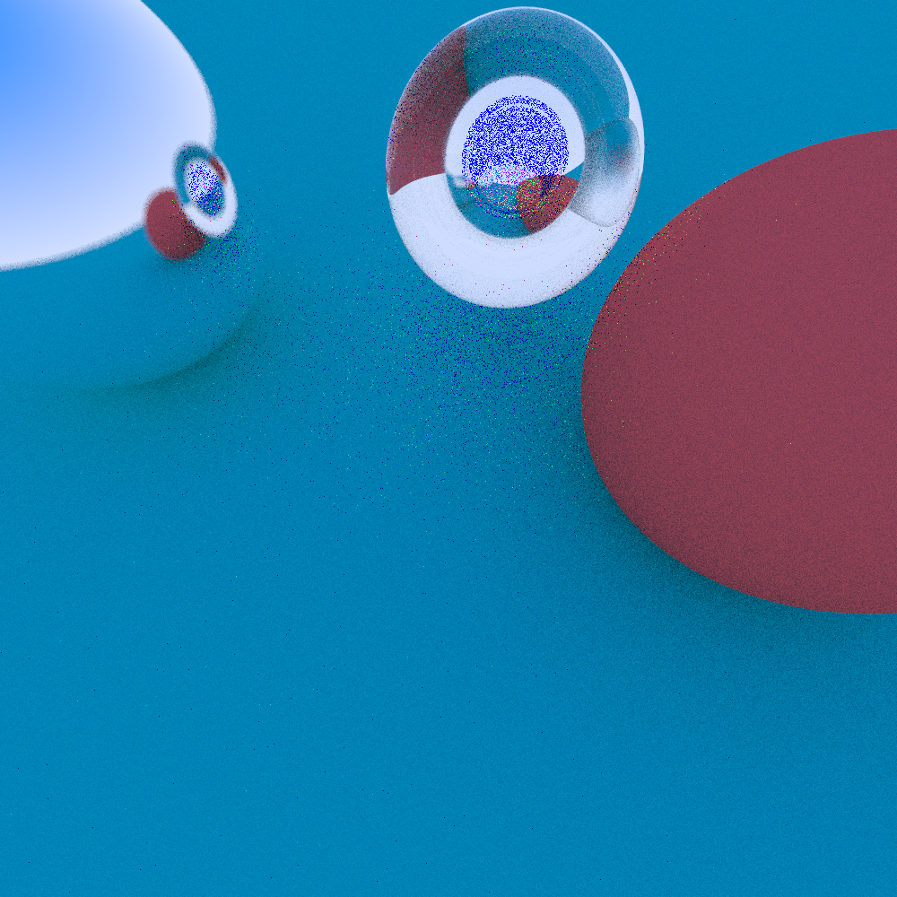

### softrays
A simple software raytracer built for education purposes.
Inspired by the excellent "Raytracing in one weekend" by Peter Shirley.

### Demo
Run `cargo run [--release] --example image <width> <height> <output file>`

Will output something like :

